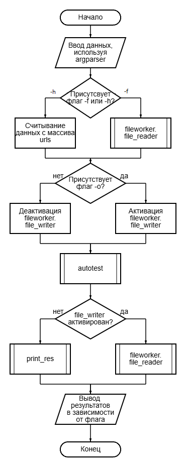
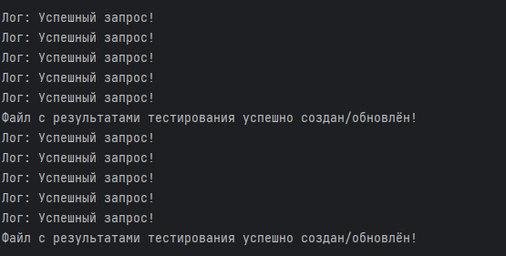
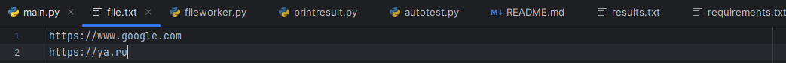
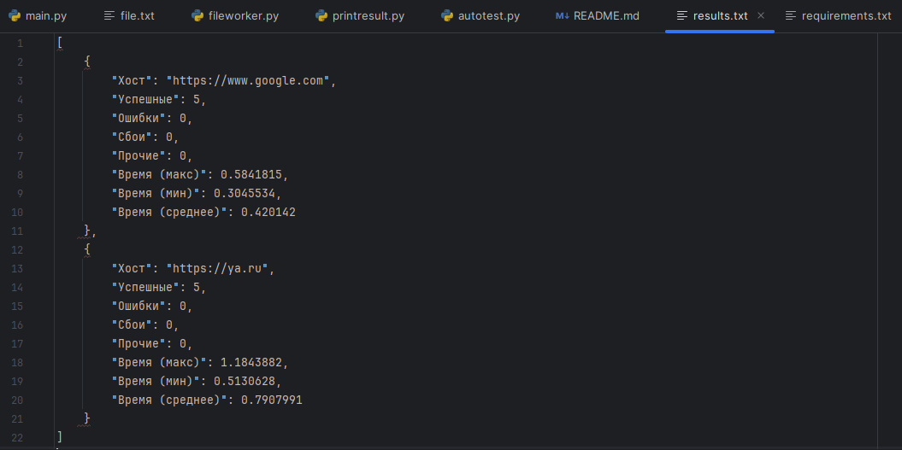
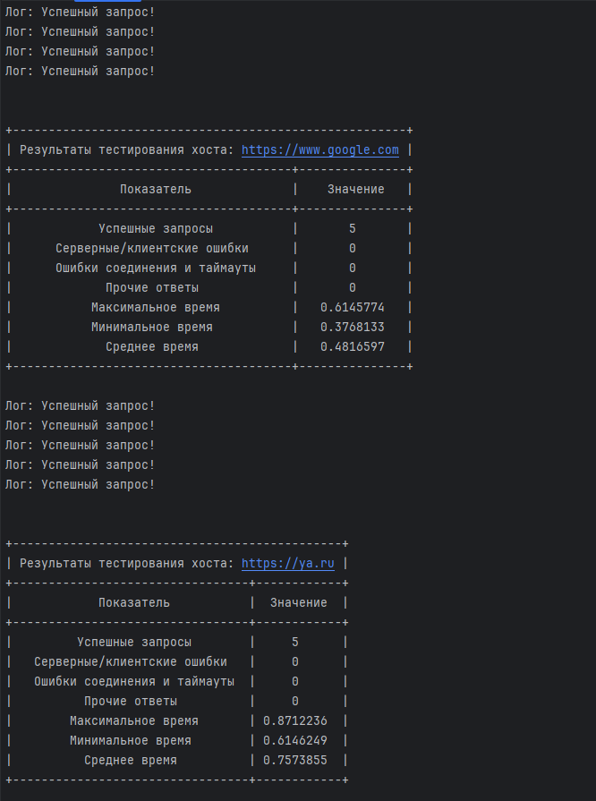
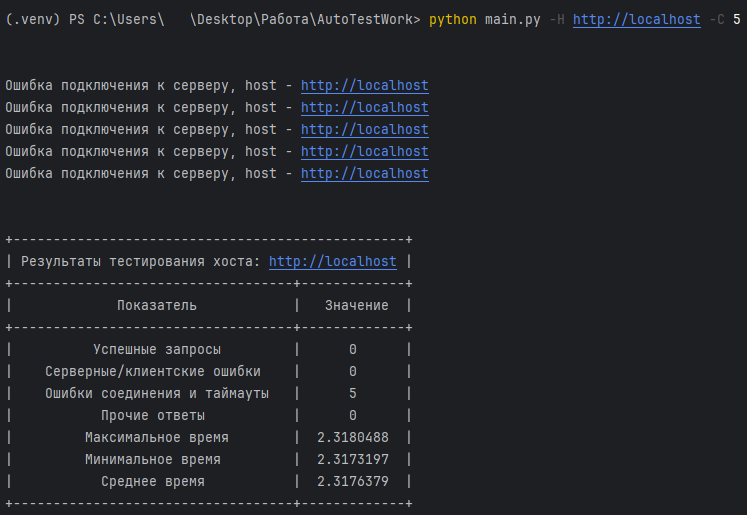
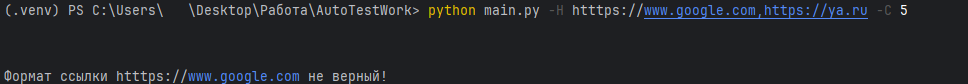

[](https://pypi.org/project/aiohttp/)


# Задание (Автотестирование Python)
## Реализовать консольную программу для тестирования доступности серверов по HTTP протоколу. Программа должна замерять время выполнения запроса и выводить итоговую статистику по скорости ответа сервера.

Реализованная программа должна выполнять следующие требования:

1. Принимать в качестве аргумента командной строки ключ –H/--hosts со значением хоста, на который будут выполняться запросы. Можно указать несколько адресов через запятую без пробелов;

2. Возможность указать ключ –C/--count со значением количества запросов, которые будут отправлены на каждый хост для выведения среднего значения (по умолчанию 1);

3. Выводить итоговую статистику по выполненным запросам для каждого хоста отдельно.
   Формат вывода должен быть удобным для чтения и явно разделять показатели для каждого хоста. В выводе нужно отобразить такие значения, как:

* Host – имя тестируемого хоста
* Success – количество успешных запросов
* Failed – количество запросов, на которые сервер ответил ошибкой (400 или 500)
* Errors – количество запросов, во время которых сервер был недоступен
* Min – минимальное время выполнения запроса
* Max – максимальное время выполнения запроса
* Avg – среднее время выполнения запроса.

4. Ошибки должны быть обработаны с помощью блоков try/except, чтобы пользователь видел человекочитаемый текст.

Допускается использовать библиотеки только для выполнения http запросов такие, как httpx, aiohttp или requests. В остальных случаях нужно использовать только стандартные библиотеки python (argparse будет достаточно для обработки аргументов).

Пример запуска программы для тестирования ya.ru и google.com с пятью запросами:
python bench.py –H [https://ya.ru,htttps://google.com](https://ya.ru,htttps://google.com) -C 5

Дополнительные задания:

1. Добавьте проверку входных параметров на соответствие типу и формату. Параметр count может принимать только число. Параметр hosts должен принимать адреса в формате [https://example.com](https://example.com). Для проверки формата адреса попробуйте использовать регулярные выражения, но это не является обязательным требованием.

2. Добавьте возможность указывать имена файлов для входных и выходных данных:

* Ключ –F/--file – путь до файла со списком адресов, разбитый на строки. Одновременно может быть указан только один из ключей –F или -H.
* Ключ –O/--output – путь до файла, куда нужно сохранить вывод. Если не указан, то вывод отправляется в консоль.

Задание с повышенной сложностью:
Последовательное выполнение запросов занимает много времени. Попробуйте оптимизировать работу с помощью конкурентного программирования. Используйте потоки или асинхронность для распараллеливания выполнения запросов.

------------------------

# Решение
## Блок - схема программного обеспечения

## Описание блоков:

* fileworker - модуль, отвечающий за работу с файлами(чтение, запись)
* autotest - модуль, отвечающий за выполнение запросов и обработку ответа от сервера
* print_res - модуль, отвечающий за вывод информаций в терминал
---

# Тестирование
## Команда(Демонстрация №1)
```bash
python main.py -f file.txt -o results.txt -C 5
```
## Результат

## Файл file.txt

## Файл result

!

## Команда(Демонстрация №2)
```bash
python main.py -H https://www.google.com,https://ya.ru -C 5
```
## Результат


## Команда(Демонстрация №3)
```bash
python main.py -H http://localhost -C 5
```
## Результат


## Команда(Демонстрация №4. Ошибка в url)
```
python main.py -H htttps://www.google.com,https://ya.ru -C 5
```
## Результат


---
# Отчёт по разработке
## Основная часть
### В ходе разработки программного обеспечения, были учтены и реализованны все требования, прописанные в основном блоке технического задания. Программа отправляет запросы на сервер, в зависимости от числа count, которое ввёл пользователь, и отправляет статус ответа сервера. Рассчитываются все необходимые показатели времени. 
## Дополнительная часть
### 1. Добавлена проверка входных данных на верный тип и формат. Проверка Url формата реализованна при помощи стороней библиотеки Pydantic, что делает вид листинга программы удобнее для прочтения. 
```py
Файл fileworker.py
from pydantic import HttpUrl,ValidationError,BaseModel
class URLModel(BaseModel):
    url: HttpUrl

def url_checker(url: str):
    try:
        URLModel(url=url)
        return True
    except ValidationError:
        return False
```
```py
файл main.py и fileworker.py
 for i in urls:
        if not url_checker(i):
            print(f"Формат ссылки {i} не верный!")
            sys.exit(1)
```
### 2. Добавлен модуль для работы с файлами (fileworker), для активаций которого нужно указать верный флаг в терминале -f/-H
```py
     try:
        if args.count <= 0: #Проверка верного значения для количества запросов
            raise ValueError("Аргумент --count должен быть положительным числом > 0.")
    except ValueError as e:
        print(f"Ошибка: {e}")
        sys.exit(1)

    if args.hosts: #Проверка источника данных
        urls = [url.strip() for url in args.hosts.split(',') if url.strip()]
        if not urls:
            print("Ошибка: список URL пуст.")
            sys.exit(1)
        for i in urls:
            if not url_checker(i):
                print(f"Формат ссылки {i} не верный!")
                sys.exit(1)
    elif args.file:
        try:
            fw = file_worker(args.file)
            urls = fw.file_reader()
        except ValueError as e:
            print(e)
            sys.exit(1)

    if args.output: #Проверка способа экспорта
        try:
            fw = file_worker(args.output)
        except Exception as e:
            print(f"Ошибка при создании файла: {e}")
            sys.exit(1)
    else:
        fw = None
```
## Задание повышенной сложности
### Программа оптимизирована при помощи использования aiohttp. Сторонней библиотеки, которая функционирует по принципам асинхроннсти 
### Применена функция asyncio.gather(*tasks), которая запускает сразу несколько асинхронных задач
```py
async def make_send(self):
    async with ClientSession() as session:
        for host in self.hosts:
            result_test = {"Success": 0, "Failed": 0, "Error": 0, "Other": 0}
            time_test = {"Max": 0, "Min": 999999, "Avg": 0}
            all_times = []
            tasks = [self.complite_send(session, host, result_test, all_times) for count_start_http in range(self.count_session)]
            await asyncio.gather(*tasks) # оптимизация при помощи ансинхронного выполнения задач
```
---
# Использование библиотек
## 📌 "aiohhtp" - работа с http запросами
## 📌 "pydantic"- валидация форматов данных
## 📌 "prettytable" - удобное отображение выходных данных при помощи таблиц
## 📌 "statistics" - подгрузка удобных функций для работы с массивом
## 📌 "argparse" - осуществление удобной работы с терминалом
## 📌 "pytest" - демонстрация тестирования некоторых возможностей

## Файл requirements
```commandline
argparse~=1.4.0
aiohttp~=3.12.14
prettytable~=3.16.0
pydantic~=2.11.7
pytest~=8.4.1
```
---

# Руководство пользователя
## Программа автотестирования доступности HTTP-серверов

---

### Описание  
Данная программа позволяет проверить доступность HTTP-серверов и измерить время отклика. Вы можете указать один или несколько адресов, а также количество запросов к каждому серверу. Программа выводит статистику по каждому хосту.

---

## Обработка ошибок
* При неверном формате URL программа выведет сообщение об ошибке и завершит работу.

* Ошибки сетевого соединения и таймауты учитываются и подсчитываются в статистике.

* Все ошибки обрабатываются, чтобы пользователь получил понятные сообщения.

## Требования к окружению

* Python 3.10 и выше

* Установленные библиотеки: aiohttp, pydantic, prettytable, argparse


## Установка зависимостей
```bash
pip install -r requirements.txt
```
## Запуск (терминал)
### Флаги (регистр важен!)
* -H, --hosts — передача URL-адресов через запятую, например: -H "https://ya.ru,https://google.com"
* -f, --file — передача пути к файлу с URL-адресами (по одному на строку), например: -f urls.txt
* -o, --output — путь к JSON-файлу для сохранения результатов, например: -o results.json
* -C, --count — количество запросов к каждому сайту, по умолчанию 1, пример:-C 5

```
python main.py [-h] (-H HOSTS | -f FILE) [-o OUTPUT] [-C COUNT]
```
